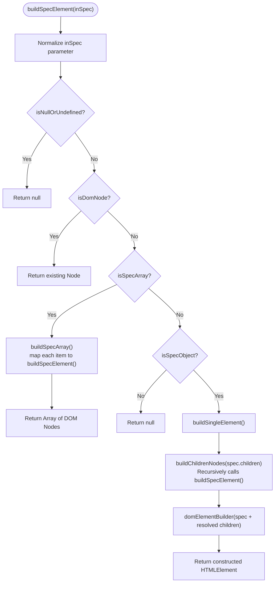

# Architecture & Engine Pipeline: The JSON-to-DOM Bridge

This document details the internal architecture, module structure, recursive tree traversal, and execution lifecycle of the `json-to-dom` engine.

---

## 1. The Core Architectural Boundary

The foundational principle of this project is a strict boundary between two distinct worlds:

```
┌─────────────────────────────────────────────────────────────┐
│                     JSON SPECIFICATION WORLD                │
│  - Pure, serializable Javascript / JSON data structures     │
│  - No references to document, window, or HTMLElement        │
│  - Safe for server-side generation, caching, and pipes     │
│  - Transformed by pipelines (Themes, Columns, Filters)      │
└──────────────────────────────┬──────────────────────────────┘
                               │
                      buildSpecElement()
                               │
                               ▼
┌─────────────────────────────────────────────────────────────┐
│                         DOM WORLD                           │
│  - Live browser Document Object Model (DOM) elements        │
│  - Node instances (HTMLDivElement, HTMLTableElement, etc.)  │
│  - Event listeners, active attributes, and live mutations   │
└─────────────────────────────────────────────────────────────┘
```

By keeping the JSON world isolated from the DOM world until the very last stage, the system achieves:
1. **High Performance**: UI specifications can be modified, validated, themed, and composed in memory without triggering costly browser DOM operations or layout reflows.
2. **Determinism**: The same JSON input guarantees the identical DOM output.
3. **Pluggable Pipelines**: Table structures, form skeletons, or complex dashboards can be manipulated through simple function chains before rendering.

---

## 2. Directory & Module Breakdown

The core engine lives under `src/v2/build/` and is divided into two distinct responsibilities:

```text
src/v2/build/
├── buildSpecElement.js         # Top-level dispatcher and type boundary
│
├── buildSpec/                  # Traversal, validation & child resolution
│   ├── isNullOrUndefined.js    # Guard: detects null, undefined, or empty values
│   ├── isDomNode.js            # Guard: checks if node is already an instance of Node
│   ├── isSpecArray.js          # Guard: checks if specification is an Array
│   ├── isSpecObject.js         # Guard: checks if specification is a valid object
│   ├── buildSpecArray.js       # Array handler: maps array items recursively
│   ├── buildChildrenNodes.js   # Child resolver: maps children specs to DOM nodes
│   └── buildSingleElement.js   # Bridges spec node with elementBuilder
│
└── elementBuilder/             # Low-level DOM instantiation and configuration
    ├── createElement.js        # document.createElement(inTagName)
    ├── applyTextContent.js     # Assigns el.textContent
    ├── applyProperties.js      # Object.assign(el, inProperties)
    ├── applyAttributes.js      # Sets attributes and special-cases 'class'
    ├── applyClassList.js       # Splits string tokens and invokes el.classList.add()
    ├── applyEvents.js          # Binds event listeners via addEventListener()
    ├── appendChildren.js       # Appends resolved Node instances to the parent
    └── index.js                # Orchestrates the 5-step element creation sequence
```

---

## 3. The Recursive Execution Flow

When `buildSpecElement({ inSpec })` is called, the traversal proceeds in a depth-first, bottom-up order:



### 3.1 Normalization and Guard Clauses

The entry point `buildSpecElement.js` allows both wrapped `{ inSpec: data }` objects and direct `data` arguments for convenience:

```javascript
export const buildSpecElement = (inSpec) => {
    const localSpec = (inSpec && typeof inSpec === "object" && "inSpec" in inSpec && !(inSpec instanceof Node) && !Array.isArray(inSpec))
        ? inSpec.inSpec
        : inSpec;

    if (isNullOrUndefined({ inSpec: localSpec })) return null;
    if (isDomNode({ inSpec: localSpec })) return localSpec;
    if (isSpecArray({ inSpec: localSpec })) return buildSpecArray({ inSpec: localSpec });
    if (!isSpecObject({ inSpec: localSpec })) return null;

    return buildSingleElement({ inSpec: localSpec });
};
```

### 3.2 Bottom-Up Child Resolution

Before creating the current parent DOM node, `buildSingleElement` resolves all child specs into live DOM nodes:

```javascript
export const buildSingleElement = ({ inSpec }) => {
    const localSpec = inSpec;
    const localChildrenNodes = buildChildrenNodes({ inChildren: localSpec.children });

    return domElementBuilder({
        inSpec: {
            ...localSpec,
            children: localChildrenNodes
        }
    });
};
```

This guarantees that when `domElementBuilder` executes, its `children` array already contains real `Node` instances ready for immediate insertion.

---

## 4. The 5-Step Element Builder Pipeline

Once a spec object and its resolved children reach `src/v2/build/elementBuilder/index.js`, they pass through an ordered sequence:

```javascript
const startFunc = ({ inSpec, inClassList }) => {
    const localSpec = inSpec;
    const localClassList = inClassList;

    if (!localSpec || !localSpec.tagName) return null;

    // 1. Create Element
    const element = createElement({ inTagName: localSpec.tagName });

    // 2. Apply Text Content & Properties
    applyTextContent({ inElement: element, inTextContent: localSpec.textContent });
    applyProperties({ inElement: element, inProperties: localSpec.properties });

    // 3. Apply Attributes & Classes
    applyAttributes({ inElement: element, inAttributes: localSpec.attributes });
    applyClassList({ inElement: element, inClassList: localClassList });

    // 4. Bind Event Listeners
    applyEvents({ inElement: element, inEvents: localSpec.events, inTagName: localSpec.tagName });

    // 5. Append Children
    appendChildren({ inElement: element, inChildren: localSpec.children });

    return element;
};
```

### Detailed Step Explanations:

| Step | Function | Responsibility |
| :--- | :--- | :--- |
| **1. Create Element** | `createElement` | Invokes native `document.createElement(localTagName)`. |
| **2. Text & Props** | `applyTextContent`<br>`applyProperties` | Sets `element.textContent` safely if provided. Uses `Object.assign` for JavaScript DOM properties (e.g., `checked`, `value`, `disabled`). |
| **3. Attributes & Classes** | `applyAttributes`<br>`applyClassList` | Iterates `attributes` using `setAttribute()`. If an attribute is named `"class"`, it sets `className`. Also appends any additional space-separated class tokens via `classList.add(...)`. |
| **4. Event Binding** | `applyEvents` | Loops through `events` key-value pairs (e.g., `{ click: fn }`) and calls `addEventListener(eventName, listener)`. |
| **5. Append Children** | `appendChildren` | Iterates through pre-resolved child `Node` objects and invokes `element.appendChild(child)`. |

---

## 5. Architectural Coding Standard: `in...` & `local...` Pattern

All functions across the codebase strictly follow a standardized parameter and variable convention:

1. **Named Object Parameter**: Every function accepts a single options object with properties prefixed with `in` (e.g., `inSpec`, `inElement`, `inTagName`, `inChildren`).
2. **Immediate Local Binding**: The first lines of the function assign these incoming properties to local variables prefixed with `local` (e.g., `const localSpec = inSpec;`).

### Example:

```javascript
export const applyAttributes = ({ inElement, inAttributes }) => {
    const localElement = inElement;
    const localAttributes = inAttributes;

    if (localAttributes) {
        Object.entries(localAttributes).forEach(([attrName, val]) => {
            if (attrName === "class") {
                localElement.className = val;
            } else {
                localElement.setAttribute(attrName, val);
            }
        });
    }
    return localElement;
};
```

### Benefits:
- **Prevent Parameter Mutation**: Ensures incoming arguments are never accidentally re-assigned.
- **Predictable API Surface**: Callers do not have to guess parameter ordering.
- **Traceability**: Easily distinguishes incoming parameters from internally scoped calculations during code reviews and debugging.

---

## 6. Upstream Transformation Pipelines

In larger applications (as detailed in [DETAILS.md](../DETAILS.md)), `buildSpecElement()` sits at the end of a transformation pipeline:

```text
God Spec (Base JSON)
       │
       ▼
Theme Resolution (Apply Tailwind / CSS styles to JSON nodes)
       │
       ▼
Table Pipeline (Inject headers, serial numbers, action columns)
       │
       ▼
Resolved JSON Spec
       │
       ▼
buildSpecElement()
       │
       ▼
Browser DOM
```

Because `buildSpecElement` is completely decoupled from business logic, themes and transformations can be tested purely with JSON assertions without needing a browser environment or DOM mocks.
